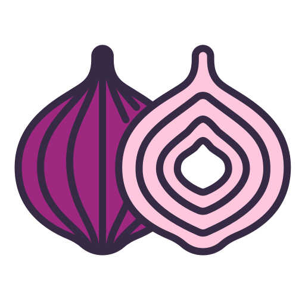
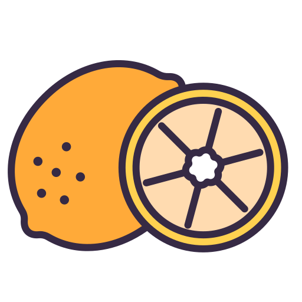

<div align="center">
  <p>
    
    
    
    
    
  </p>

  <h1>Garden University Student Course Enrollment Portal</h1>

  <p>
    A student portal for searching and enrolling in Garden University's
    delicious and nutritious garden courses.
  </p>

  <p>
    <strong>Sarah Manago</strong><br>
    CST499: Capstone for Computer Software Technology<br>
    Final Capstone Project<br>
    Due October 12, 2026
  </p>
</div>

## About the project

Garden University's Student Course Enrollment System (SCES) is a PHP and MySQL web application that demonstrates a complete course-registration workflow. Students can create an account after their university record is verified, search scheduled course offerings, enroll or join a waitlist, and manage their schedule from a weekly calendar view.

The application uses a garden-inspired interface, playful course catalog, and program-specific artwork while demonstrating relational database design, session-based authentication, enrollment rules, and integration with an external student system.

## Features

- Student registration validated through a mock Student Information System (SIS).
- Session-based login, logout, personalized navigation, and student profile.
- Course search by program, semester, and course ID.
- Course cards showing class days, time, dates, capacity, and available seats.
- Program-themed artwork displayed as course-card watermarks.
- Enrollment with confirmation and schedule-conflict detection.
- Automatic waitlisting when a course is full.
- Course dropping and waitlist removal from the student's schedule.
- My Courses lists grouped by semester.
- Weekly calendar showing enrolled and waitlisted course meetings.

## Technology

- PHP with MySQLi
- MySQL
- Apache through XAMPP
- HTML, CSS, Bootstrap 5, and Bootstrap Icons

## Local setup

1. Install XAMPP with Apache, PHP, and MySQL/MariaDB.
2. Place or clone the project at:

   ```text
   C:\xampp\htdocs\cst499capstone-sces
   ```

3. Start **Apache** and **MySQL** from the XAMPP Control Panel.
4. Create or import the MySQL database named:

   ```text
   cst499capstone_scesdb
   ```

5. Confirm the local credentials in `Database.php`. The capstone configuration uses XAMPP's local default:

   ```text
   Host: localhost
   User: root
   Password: (blank)
   Database: cst499capstone_scesdb
   ```

6. Open the application at [http://localhost/cst499capstone-sces/](http://localhost/cst499capstone-sces/).

> This configuration is intended for a local capstone demonstration. Production credentials should be stored outside the source code and should never use a blank password.

## Student Information System integration harness

SCES includes a small integration harness that simulates Garden University's external Student Information System. It lets the registration and enrollment workflows be demonstrated without connecting to a real university service or using real student data.

The harness is split into three pieces:

| File | Responsibility |
| --- | --- |
| `services/StudentInformationSystemInterface.php` | Defines the `findStudent()` contract used by SCES. |
| `services/MockStudentInformationSystem.php` | Implements the contract and performs case-insensitive Student ID lookups. |
| `mockSisStudents.php` | Contains fictional student records returned by the mock implementation. |

During registration, SCES:

1. Looks up the submitted Garden University Student ID.
2. Confirms that the student exists and is active.
3. Confirms that the submitted name, university email, and selected program match the SIS record.
4. Copies the verified enrollment date and active status into the SCES student account.

Before a student enrolls in a course or joins a waitlist, SCES checks the mock SIS again and blocks the request if the student is no longer active.

### Mock SIS records

These records are fictional and are safe to use when demonstrating the project. The student chooses an SCES password while registering; passwords are not stored in the mock SIS data.

| Student ID | Student | University email | Program | Status |
| --- | --- | --- | --- | --- |
| `GU11111` | Valerie Veggie | `val.veggie@gusalad.edu` | Ranch Dressing Chef | Active |
| `GU22222` | Caprese Tomato | `ctomato@gusalad.edu` | Herbology | Active |
| `GU33333` | Flowery Blossoms | `snapdragon123@gusalad.edu` | Floral Design | Active |
| `GU44444` | Mandy Merlot | `grapes.merlot@gusalad.edu` | Vines and Wines Vintner | Active |
| `GU55555` | Sage Sprout | `sage.sprout@gusalad.edu` | Soil Science | Active |
| `GU66666` | Ivy Dormant | `ivy.dormant@gusalad.edu` | Garden Planning | Inactive |

`GU55555` is useful for demonstrating successful registration. `GU66666` demonstrates the inactive-student validation path. The `programId` values in `mockSisStudents.php` must correspond to records in the local `program` table.

### Replacing the mock with a real SIS

A production connector can implement `StudentInformationSystemInterface` and return the same student-record fields. `Register.php` and `BrowseCourses.php` can then instantiate the real connector instead of `MockStudentInformationSystem`, while the rest of the validation workflow remains unchanged.

## Project layout

```text
cst499capstone-sces/
├── assets/                         Vegetable and program artwork
├── css/styles.css                  Application styling
├── services/
│   ├── MockStudentInformationSystem.php
│   └── StudentInformationSystemInterface.php
├── BrowseCourses.php               Search, enrollment, and waitlisting
├── Database.php                    Local database connection helper
├── Login.php                       Authentication
├── MyCourses.php                   Schedule list and weekly calendar
├── Profile.php                     Student profile
├── Register.php                    SIS-verified account registration
├── index.php                       Home page
└── mockSisStudents.php             Fictional SIS records
```

<div align="center">
  <p>
    
    
    
    
  </p>
  <em>Grow your schedule, one course at a time.</em>
</div>
